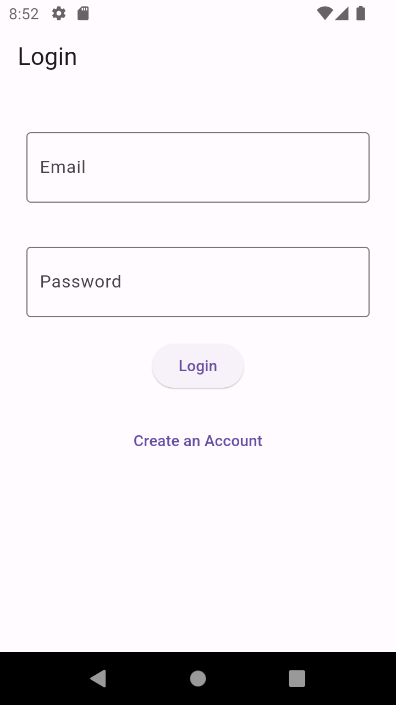
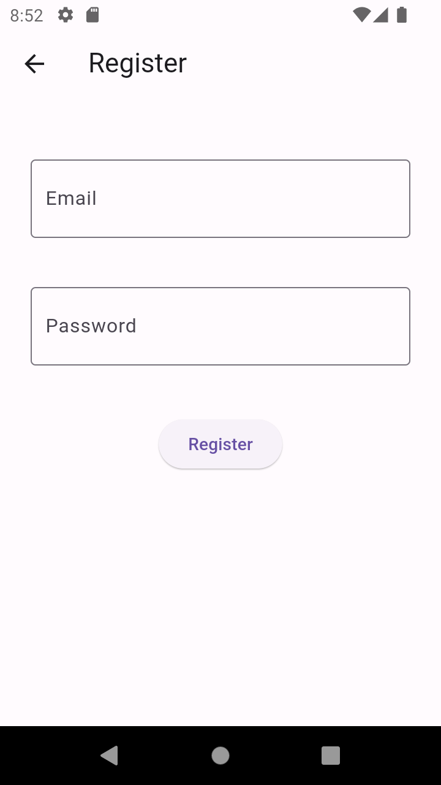
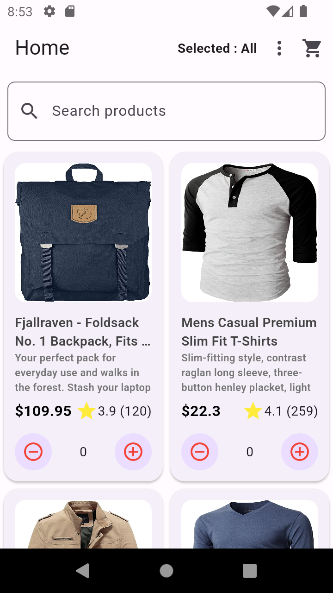
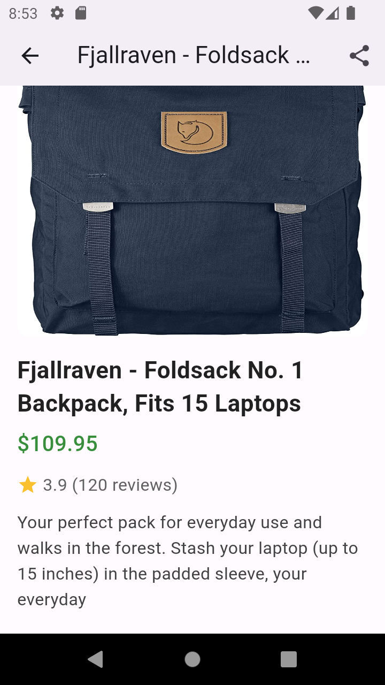

### webmobril_test

## A Flutter project built using Flutter 3.16.0 ver.

## 1. Clone the Repository
## 2. Install Dependencies
## 3. Run the App (Android)
# Login page

# Register page

# Home page

# Datail page

